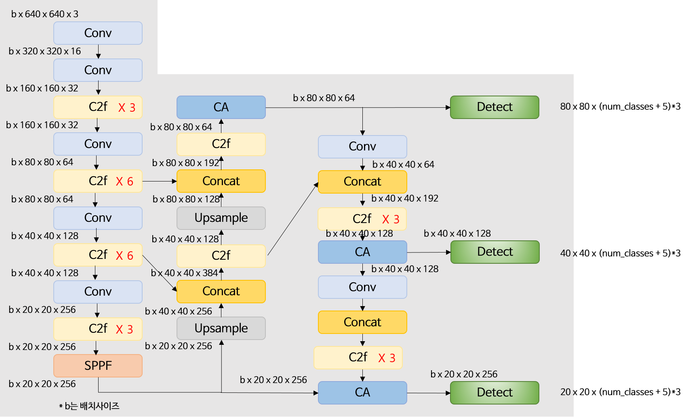

# yolov8-with-coordinate_attention
This project has modified the following repository by ultralytics ([link](https://github.com/ultralytics/ultralytics)).

The [Coordinate Attention](https://arxiv.org/pdf/2103.02907.pdf) module, as proposed, has been applied to the yolov8 model.

A PyTorch-implemented coordinate attention block was used.
(https://github.com/xmu-xiaoma666/External-Attention-pytorch/blob/master/model/attention/CoordAttention.py)

</img>

### Modifications to the original code
**[1] Addition of the block to be used**
1. Added the 'coordatt.py' code file to ultralytics/ultralytics/nn/modules
   -> Wrote the coordinate attention block in the PyTorch framework

2. Modified ultralytics/ultralytics/nn/modules/__init__.py
   -> Added 'from .coordatt import CoordAtt' and 'CoordAtt' to `__all__`

3. Added CoordAtt block to ultralytics/ultralytics/nn/tasks.py

**[2] Modification of model structure**
1. Added 3 CoordAtt blocks to the head part in ultralytics/ultralytics/cfg/models/v8/yolov8.yaml

**[3] Modification of model training code**
4. Modified train_ca.py (training code)
   -> model = YOLO("./cfg/models/v8/yolov8n.yaml")

### Note
The current yolov8.yaml file is written based on the nano model. If you wish to use other sizes of models such as s, l, xl, etc., you must modify the arguments going into the CoordAtt block in yolov8.yaml.

### If you want to add other block into YOLOv8
How about referring to this post? ([link]) 
